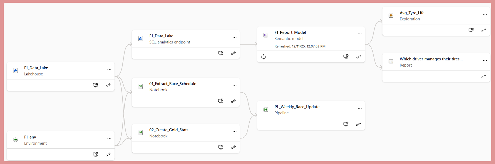
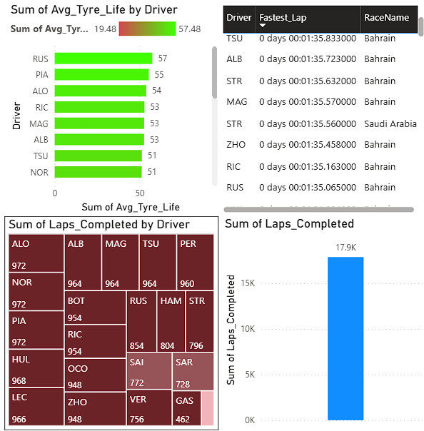

# Formula 1 Data Engineering & Analytics Pipeline

<div align="center">
  
</div>

An end-to-end Data Engineering solution transforming raw F1 telemetry into actionable race strategy insights.

## 📖 Executive Summary

This project establishes a comprehensive Data Engineering Pipeline to analyze Formula 1 championship data. By ingesting data from the Ergast API and FastF1, the system processes historical and real-time race telemetry to uncover insights regarding tyre degradation, driver performance, and constructor strategies.

The solution implements a Medallion Architecture (Bronze, Silver, Gold) to ensure data quality, scalability, and traceability, culminating in interactive dashboards for end-user analytics.

## 🏗️ Architecture & Data Lineage

The pipeline utilizes a modern data lakehouse approach. Data flows through strict validation stages before being served for reporting.

### The Pipeline Stages:

1. **Bronze Layer (Raw)**: Ingestion of JSON/CSV data from external APIs into the data lake.
2. **Silver Layer (Cleansed)**: Schema enforcement, data typing, handling null values, and standardization of driver/constructor names.
3. **Gold Layer (Curated)**: Business-level aggregations (e.g., Driver Standings, Lap Time Analysis) ready for BI consumption.

### Data Lineage Visualization

The following diagram illustrates the transformation logic and dependencies established within the workspace, showing the flow from raw source to final tables.

<div align="center">
  
</div>

## 🛠️ Tech Stack & Tools Used

* **Cloud Infrastructure**: Microsoft Fabric / Azure Data Lake Gen2
* **Processing Engine**: Apache Spark (PySpark) & Pandas
* **Orchestration**: Data Factory / Notebook Pipelines
* **Visualization**: Power BI & Matplotlib/Seaborn
* **Format**: Delta Parquet (for ACID transactions and time-travel)

## 📊 Analytics & Insights

The transformed data powers a suite of visualizations designed to answer critical race strategy questions.

### 1. Championship Dashboard

A high-level view of the season, tracking driver points, constructor standings, and race results.

<div align="center">
  
</div>

### 2. Telemetry Correlation

I performed a deep-dive analysis on vehicle telemetry to understand the relationship between Speed, RPM, Gear, and Throttle application during a qualifying lap.

### 3. Tyre Strategy & Degradation

This analysis focuses on tyre management, visualizing lap times across different compounds to identify "crossover points" for pit stop strategies.

## 🚀 Key Achievements

* **Automated Ingestion**: Developed a parameterized pipeline to fetch new race data automatically post-race.
* **Schema Enforcement**: Implemented rigid checks to prevent data drift from API changes.
* **Performance Optimization**: Utilized partitioning and Z-ordering on Delta tables to optimize query performance for large telemetry datasets.
* **Complex Aggregations**: Calculated "Dominance Metrics" and "Pit Stop Efficiency" which are not available in the raw data.

## 📂 Project Repository Structure

```
├── config/                 # Configuration files for paths and secrets
├── data/                   # Local sample data (if applicable)
├── images/                 # Documentation assets
│   ├── dashboard.png
│   ├── formula1logo.png
│   ├── heatmap.png
│   ├── lineageview.png
│   └── tyre_saving.png
├── notebooks/              # Transformation logic (Bronze, Silver, Gold)
│   ├── 01_ingestion/
│   ├── 02_transformation/
│   └── 03_aggregation/
├── src/                    # Utility scripts and common functions
├── requirements.txt        # Project dependencies
├── .gitignore
└── README.md
```

## 🔮 Future Roadmap

* [ ] **Real-time Streaming**: Implement Structured Streaming for live lap-by-lap analysis during race weekends.
* [ ] **Predictive Modeling**: Integrate MLflow to predict probability of overtaking based on track sector times.
* [ ] **CI/CD Integration**: Automate testing and deployment of pipelines using Azure DevOps or GitHub Actions.

---

Built with 🏎️ and Python by Balaji Thukuntala